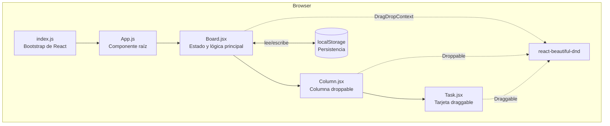
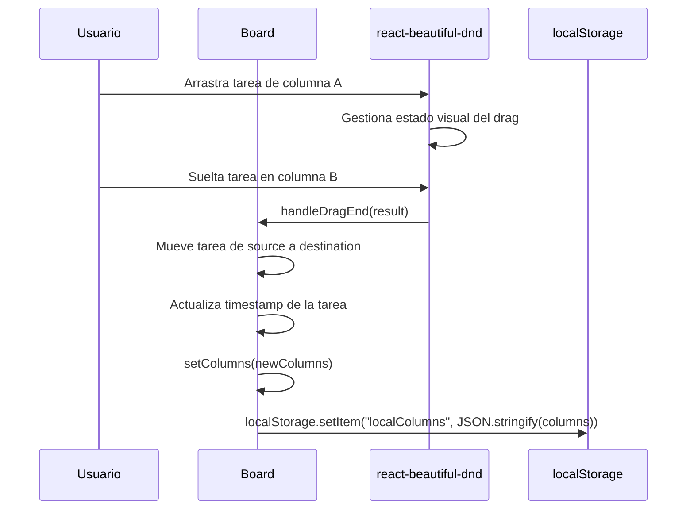
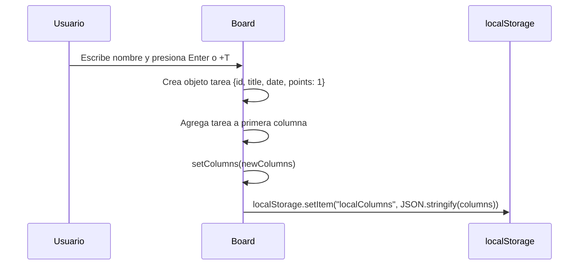

# Architecture

## Scope

- Target: repositorio completo
- Boundary: aplicación React SPA dentro de `kanban/`
- Docs location: `docs/`

## Confidence Note

- **Confirmed** from repository evidence: estructura de componentes, flujo de datos, persistencia en localStorage, uso de react-beautiful-dnd
- **Inferred** from code patterns: modelo de datos implícito en el estado del componente Board
- **Needs confirmation**: no se encontró configuración de despliegue ni infraestructura

## Overview

KanbanBoard sigue una arquitectura de **Single Page Application (SPA)** del lado del cliente, construida con React. No existe backend ni API — toda la lógica reside en el navegador. El estado de la aplicación se gestiona mediante hooks de React (`useState`, `useEffect`) en el componente `Board`, que actúa como contenedor principal de estado. La persistencia se logra escribiendo y leyendo directamente de `localStorage`.

## Architecture Style

- Pattern: SPA del lado del cliente (client-side monolith)
- Complexity: simple
- Rationale: un solo punto de entrada (`index.js`), un solo componente con estado (`Board`), sin backend, sin API, sin base de datos externa. Todo el estado y la lógica de negocio residen en el componente Board.

## Components

### Descripción de componentes

| Componente | Tipo                 | Responsabilidad                                                                        |
| ---------- | -------------------- | -------------------------------------------------------------------------------------- |
| `index.js` | Entry point          | Monta `<App />` en el DOM                                                              |
| `App`      | Presentacional       | Envuelve `Board` con estructura HTML base                                              |
| `Board`    | Container (stateful) | Gestiona estado de columnas/tareas, CRUD, drag & drop, sincronización con localStorage |
| `Column`   | Presentacional       | Renderiza una columna como zona `Droppable`, muestra título y contador de tareas       |
| `Task`     | Stateful (local)     | Renderiza tarjeta `Draggable` con edición inline, eliminación y puntos de estimación   |

### Flujo de datos

El flujo de datos sigue un patrón **unidireccional de arriba hacia abajo**:

1. `Board` mantiene el estado canónico (`columns`) y las funciones de mutación (`taskFunctions`)
2. `Board` pasa los datos de cada columna y las funciones de mutación a `Column` via props
3. `Column` pasa los datos de cada tarea y las funciones de callback a `Task` via props
4. `Task` invoca callbacks (`onEdit`, `onDelete`) que actualizan el estado en `Board`
5. `Board` persiste cambios en `localStorage` mediante un `useEffect`

## Key Flows

### Drag & Drop de una tarea entre columnas

### Creación de una tarea

## Cross-Cutting Concerns

| Concern           | Enfoque                                                                                 |
| ----------------- | --------------------------------------------------------------------------------------- |
| Persistencia      | `localStorage` — serialización JSON automática en cada cambio de estado via `useEffect` |
| Generación de IDs | `uuid` v4 — IDs únicos para columnas y tareas                                           |
| Estilos           | CSS con variables custom (CSS custom properties) en `:root`, tema oscuro                |
| Error handling    | No hay manejo explícito de errores (ej. localStorage lleno, JSON inválido)              |
| Testing           | Jest + React Testing Library — un test de ejemplo presente                              |

## Constraints and Trade-offs

- **Sin backend**: toda la persistencia depende de `localStorage`, lo que limita el almacenamiento a ~5-10 MB por origen y no permite sincronización entre dispositivos o usuarios
- **Sin autenticación**: la aplicación es de uso local/individual, sin gestión de usuarios
- **react-beautiful-dnd** está en modo de mantenimiento (no recibe nuevas features), pero funciona correctamente para este caso de uso
- **Estado centralizado en Board**: toda la lógica de estado reside en un solo componente, lo cual es adecuado para la complejidad actual pero podría requerir refactorización si la app crece significativamente
- **Build incluido en el repo**: la carpeta `build/` está commiteada, lo cual no es una práctica común pero es funcional para despliegues estáticos

## Sources Inspected

- `kanban/src/component/Board.jsx` — lógica de estado, CRUD, drag & drop, persistencia
- `kanban/src/component/Column.jsx` — estructura de columna droppable
- `kanban/src/component/Task.jsx` — estructura de tarea draggable y lógica de edición
- `kanban/src/App.js` — componente raíz
- `kanban/src/index.js` — punto de entrada
- `kanban/src/component/styles.css` — sistema de diseño con CSS custom properties
- `kanban/package.json` — dependencias y stack tecnológico
