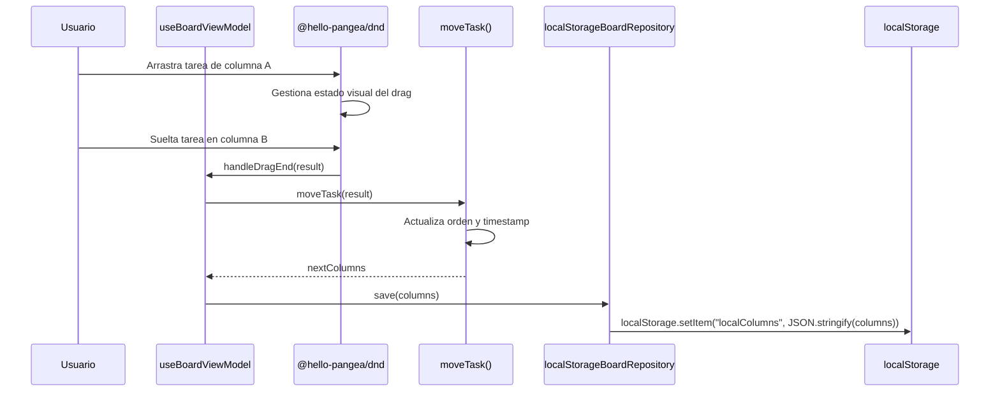
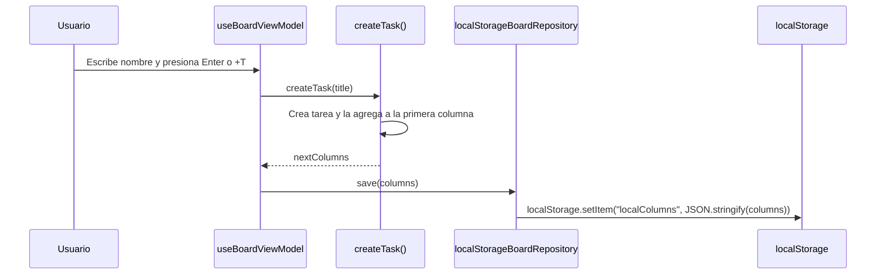

# Architecture

## Scope

- Target: repositorio completo
- Boundary: aplicación React SPA dentro de `kanban/`
- Docs location: `docs/`

## Confidence Note

- **Confirmed** from repository evidence: estructura de componentes, flujo de datos, persistencia en localStorage, uso de @hello-pangea/dnd
- **Inferred** from code patterns: modelo de datos implícito en el estado del componente Board
- **Needs confirmation**: no se encontró configuración de despliegue ni infraestructura

## Overview

KanbanBoard sigue una arquitectura de **Single Page Application (SPA)** del lado del cliente, construida con React. No existe backend ni API — toda la lógica reside en el navegador. La UI del tablero ya empezó a separarse entre presentación (`ui/`), casos de uso (`application/`), dominio (`domain/`) y persistencia (`infrastructure/`). La persistencia se logra escribiendo y leyendo directamente de `localStorage` a través de un repositorio local.

## Architecture Style

- Pattern: SPA del lado del cliente (client-side monolith)
- Complexity: simple
- Rationale: un punto de entrada HTML de Vite (`index.html`), un bootstrap React (`index.js`), una capa de UI simple y un conjunto acotado de casos de uso, sin backend, sin API y sin base de datos externa. La lógica sigue siendo pequeña, pero ya no depende de un único componente monolítico.

## Components

```mermaid
graph TB
    subgraph Browser
        Html[index.html<br>Entrada Vite] --> Index[index.js<br>Bootstrap de React]
        Index --> App[App.js<br>Componente raíz]
        App --> Page[BoardPage.jsx<br>Entrada de UI]
        Page --> VM[useBoardViewModel.js<br>Estado y acciones]
        VM --> UseCases[application/use-cases<br>Reglas de aplicación]
        UseCases --> Repo[localStorageBoardRepository<br>Persistencia]
        UseCases --> ExportUC[exportBoard.js<br>Serialización JSON/CSV]
        Page --> Board[BoardView.jsx<br>Presentación]
        Board --> Column[ColumnView.jsx<br>Columna droppable]
        Column --> Task[TaskCard.jsx<br>Tarjeta draggable]
        Board --> Palette[CommandPalette.jsx<br>Acciones rápidas]
        Board --> Drawer[TaskDetailDrawer.jsx<br>Detalle lateral]
        VM --> Download[downloadFile.js<br>Descarga en navegador]
        Repo <-->|lee/escribe| LS[(localStorage<br>Persistencia)]
        Board -.->|DragDropContext| DND[@hello-pangea/dnd]
        Column -.->|Droppable| DND
        Task -.->|Draggable| DND
    end
```

### Descripción de componentes

| Componente          | Tipo                    | Responsabilidad                                                                      |
| ------------------- | ----------------------- | ------------------------------------------------------------------------------------ |
| `index.html`        | Entry point             | Define el contenedor raíz y carga el módulo principal vía Vite                       |
| `index.js`          | Entry point             | Monta `<App />` en el DOM                                                            |
| `App`               | Presentacional          | Envuelve la entrada del tablero con estructura HTML base                             |
| `BoardPage`         | Container               | Conecta `BoardView` con `useBoardViewModel`                                          |
| `useBoardViewModel` | Application-facing hook | Orquesta estado del tablero y llama casos de uso                                     |
| `BoardView`         | Presentacional          | Renderiza la estructura general del tablero                                          |
| `ColumnView`        | Presentacional          | Renderiza una columna como zona `Droppable`, muestra título y contador de tareas     |
| `TaskCard`          | Stateful (local)        | Renderiza tarjeta `Draggable` con edición inline, eliminación y puntos de estimación |
| `TaskDetailDrawer`  | Stateful (local)        | Permite editar metadata enriquecida de una tarea                                     |
| `CommandPalette`    | Presentacional          | Expone búsqueda y ejecución rápida de acciones del tablero                           |

### Flujo de datos

El flujo de datos sigue un patrón **unidireccional de arriba hacia abajo**:

1. `useBoardViewModel` mantiene el estado canónico (`columns`) y expone handlers explícitos
2. `BoardPage` pasa el estado y handlers a `BoardView`
3. `BoardView` pasa datos y callbacks a `ColumnView`
4. `ColumnView` pasa datos y callbacks a `TaskCard`
5. `useBoardViewModel` invoca casos de uso y persiste cambios mediante `localStorageBoardRepository`
6. Las acciones globales como exportación, toasts y command palette se disparan desde `BoardView`, pero siguen delegando la ejecución al view model

## Key Flows

### Drag & Drop de una tarea entre columnas



### Creación de una tarea



## Cross-Cutting Concerns

| Concern           | Enfoque                                                                                             |
| ----------------- | --------------------------------------------------------------------------------------------------- |
| Persistencia      | `localStorage` — a través de `localStorageBoardRepository` y serialización JSON automática          |
| Generación de IDs | `crypto.randomUUID()` con fallback simple — IDs únicos para columnas y tareas                       |
| Estilos           | CSS con variables custom (CSS custom properties) en `:root`, tema oscuro                            |
| Exportación       | Serialización JSON/CSV vía `exportBoard.js` y descarga mediante `downloadFile.js`                   |
| Notificaciones    | Toast local controlado desde `useBoardViewModel` con soporte de undo para borrados recientes        |
| Error handling    | Manejo básico con `try/catch` en lectura/escritura de `localStorage`; no hay capa global de errores |
| Testing           | Vitest + React Testing Library — cobertura de render, fallback, detalle de tasks, export y undo     |

## Constraints and Trade-offs

- **Sin backend**: toda la persistencia depende de `localStorage`, lo que limita el almacenamiento a ~5-10 MB por origen y no permite sincronización entre dispositivos o usuarios
- **Sin autenticación**: la aplicación es de uso local/individual, sin gestión de usuarios
- **@hello-pangea/dnd** mantiene la API del enfoque anterior y reduce el riesgo de depender de una librería archivada
- **Refactor incremental**: conviven capas nuevas (`ui`, `application`, `domain`, `infrastructure`) con una migración progresiva, lo que reduce riesgo pero mantiene algo de deuda temporal mientras se actualiza la documentación y se agregan nuevas capacidades

## Sources Inspected

- `kanban/src/ui/board/useBoardViewModel.js` — lógica de estado, CRUD, drag & drop, persistencia
- `kanban/src/ui/board/BoardView.jsx` — estructura general del tablero
- `kanban/src/ui/board/CommandPalette.jsx` — paleta de comandos y búsqueda de acciones
- `kanban/src/ui/column/ColumnView.jsx` — estructura de columna droppable
- `kanban/src/ui/task/TaskCard.jsx` — estructura de tarea draggable y lógica de edición
- `kanban/src/ui/task/TaskDetailDrawer.jsx` — edición ampliada de metadata de tareas
- `kanban/src/App.js` — componente raíz
- `kanban/index.html` — entrada HTML de Vite
- `kanban/src/index.js` — punto de entrada
- `kanban/src/ui/shared/board.css` — sistema de diseño con CSS custom properties
- `kanban/src/application/use-cases/exportBoard.js` — serialización de exportación
- `kanban/src/infrastructure/export/downloadFile.js` — descarga de archivos en navegador
- `kanban/package.json` — dependencias y stack tecnológico
